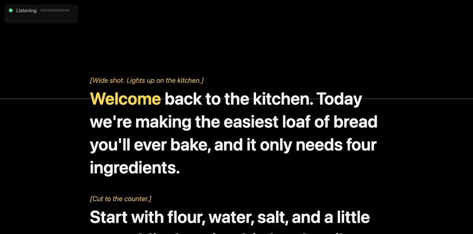

# Followspot

[](https://github.com/JoeKarlsson/followspot/actions/workflows/ci.yml)

A voice-following teleprompter that runs in your browser and listens with a local [whisper.cpp](https://github.com/ggml-org/whisper.cpp) model. Read your script out loud and the highlight follows you. Skip a sentence, flub a word, or ad-lib a little and it keeps going. Stop talking and it stops too.

Your audio never leaves your machine. The page sends it to a whisper.cpp server bound to `127.0.0.1`, and that's the only place it goes.



*Recorded with [`tools/record-demo.mjs`](tools/record-demo.mjs): real speech through the real pipeline and `medium` model, no faked scrolling. The top-left panel shows Whisper's latency and the last thing it heard.*

## Why another teleprompter?

Most browser teleprompters that follow your voice use the browser's built-in speech recognition. In Chrome that means your audio goes to Google, and you can't choose the model. Hardware prompter apps that run on-device tend to ship a small Whisper model you can't swap out. This one lets you pick any whisper.cpp model, from `base.en` on a laptop to `large-v3-turbo` on a fast Mac, and it's built to keep going when the transcript is only mostly right.

## Quick start

```bash
brew install whisper-cpp          # macOS (Linux: see below)
git clone https://github.com/JoeKarlsson/followspot.git && cd followspot
./followspot download small.en      # about 470 MB, see "Models"
./followspot download vad           # under 1 MB, recommended: stops made-up words during pauses
./followspot examples/sample.md
```

That starts the whisper server (which also serves the page) and opens `http://127.0.0.1:8178/`. Press **Space**, allow the microphone, and start reading.

Requirements: [whisper.cpp](https://github.com/ggml-org/whisper.cpp) (`whisper-server`), `curl`, and a current browser with AudioWorklet support (Chrome, Firefox, and Safari all have it). Node 20+ is only needed to run the tests.

**On Linux,** build `whisper-server` from source (this is what CI does on every pull request), then use `./followspot` as above:

```bash
git clone --depth 1 --branch v1.9.4 https://github.com/ggml-org/whisper.cpp
cmake -S whisper.cpp -B whisper.cpp/build -DCMAKE_BUILD_TYPE=Release -DBUILD_SHARED_LIBS=OFF
cmake --build whisper.cpp/build -j --target whisper-server
sudo cp whisper.cpp/build/bin/whisper-server /usr/local/bin/
```

## Using it

- **Your script is linked, not copied.** Edits you save in your editor show up within a couple of seconds. You can also drag any `.md` or `.txt` file onto the page. Run `./followspot` with no script and you get a short demo script to try.
- **Move the mouse** to bring up the control bar: listen, text size, column width, top and bottom margins, reading line, mirror, fullscreen, and more settings. It hides itself (and the pointer) after a moment.
- **Click any word** to jump there, for re-takes.
- **On a beam-splitter prompter** (Elgato Prompter and similar), drag the window to the prompter's display, go fullscreen, and turn on Mirror if the text reads backward. The text column is centered on the lens. Use the top and bottom margins to keep the text in the part of the glass you read from, and move the reading line until the current line sits at lens height.

### Keys

| Key | Does |
|---|---|
| Space | Start / pause listening |
| ← / → | Back / forward one word |
| ↑ / ↓ | Previous / next paragraph |
| R | Back to the top |
| M | Mirror |
| + / − | Text size |
| [ / ] | Column width |
| F | Fullscreen |
| S | All settings (microphone, silence gate, coast speed, listen window) |
| H | Hide the status panel |

Settings are saved in your browser.

## Script format

Plain text or Markdown.

- If the file has `---` rules, only the part between the first and second rule is the script. Everything above (title, notes) and below (a shot list) is ignored. With no rules, the whole file is the script.
- `*[Stage directions]*` and `[bracketed notes]` are shown dimmed and never listened for.
- Headings and `**Label:**` metadata lines are skipped.
- Each paragraph is a chunk you can jump between with ↑ / ↓.

See [`examples/sample.md`](examples/sample.md).

## Models

`./followspot` uses `-m path/to/model.bin` or the `FOLLOWSPOT_MODEL` environment variable if you give one. Otherwise it picks the largest model it finds, in this order:

1. `models/ggml-large-v3-turbo.bin`, `models/ggml-medium.en.bin`, `models/ggml-medium.bin`
2. Screen Studio's bundled `ggml-medium.bin`, if you have Screen Studio installed on macOS
3. `models/ggml-small.en.bin`, `models/ggml-base.en.bin`

Download any model from [the whisper.cpp model list](https://huggingface.co/ggerganov/whisper.cpp/tree/main) with `./followspot download <name>`.

| Model | Size | Notes |
|---|---|---|
| `base.en` | 142 MB | Fine for clear speech. What CI uses. |
| `small.en` | 466 MB | Good default for most laptops. |
| `medium.en` | 1.5 GB | More forgiving with names and mumbling. About 0.3 s per 3.5 s window on an M5 Max. |
| `large-v3-turbo` | 1.6 GB | Best accuracy if your machine keeps up. |

If the latency shown in the status panel climbs past about a second, switch to a smaller model. Flags after `--` go straight to `whisper-server`, for example `./followspot script.md -- --no-gpu`.

**Speed tip for slower machines:** Whisper pads every request to 30 seconds of audio, even though Followspot only sends a few seconds. `./followspot script.md -- -ac 512` limits it to about 10 seconds, which still covers the longest listen window. In benchmarks that cut CPU latency about 4x (784 to 197 ms per request on `base.en`) and GPU latency about 40% on `medium`, with the same tracking accuracy. It isn't the default yet because it occasionally produced slower worst-case requests in testing.

`FOLLOWSPOT_THREADS=N` overrides the thread count the launcher passes to whisper-server (it prints the value it uses at startup).

### Voice activity detection

Whisper will transcribe *something* from silence or room noise ("you", "thanks for watching"), and those phantom words can nudge the highlight. `./followspot download vad` fetches whisper.cpp's [Silero VAD model](https://huggingface.co/ggml-org/whisper-vad) (under 1 MB). Once it's in `models/`, the launcher turns VAD on automatically, and whisper.cpp skips non-speech audio before transcribing it: 3 seconds of silence comes back empty in about 10 ms instead of as "you" in 300. Turn it off with `--no-vad`, or tune it by passing your own `--vad` flags after `--`.

## How it follows you

```
mic ─► AudioWorklet ─► 16 kHz ring buffer ─► last 3.5 s as WAV ─► whisper-server (local)
                                                                        │ text
script ◄── highlight + scroll ◄── cursor ◄── fuzzy alignment ◄──────────┘
```

1. Every quarter second, if you're talking (a silence gate filters room noise), the page sends the last 3.5 seconds of audio to whisper.cpp.
2. The words just behind your place go along as Whisper's prompt. That nudges it toward your script's spelling of names ("Muse", not "Muze") without inviting it to guess ahead.
3. The transcript is matched against the script around your place with a fuzzy local alignment (Smith-Waterman over words). Misheard words, digits vs. spelled-out numbers, and plurals still count. It needs at least two matching words to move, more evidence to jump far ahead, and more still to move backward.
4. If you're clearly talking but nothing has matched for 1.5 seconds, the highlight coasts forward slowly so it never stalls. The next real match pulls it back into line. Set the coast speed to 0 in Settings to turn this off.

## Troubleshooting

- **"Can't reach whisper server."** The page was opened without `./followspot` running, or on a different port.
- **It doesn't move.** Check the level meter in the status panel. If it barely moves, pick the right microphone in Settings (**S**) or lower the silence gate. If "heard" text shows up but the highlight stays put, you may be reading a different part of the script: click the word you're on.
- **It runs ahead during pauses.** Make sure VAD is on (the launcher prints a `VAD:` line at startup). Then raise the silence gate, or lower or disable the coast speed.
- **It lags behind.** Look at the latency readout. Use a smaller model, or shorten the listen window in Settings.

## Development

```bash
npm install      # dev tooling (Biome); nothing in public/ depends on it
npm run lint     # Biome lint + format check, ShellCheck on the launcher (npm run format fixes)
npm run check    # syntax-check every JS file and the launcher
npm test         # unit tests for the matcher and audio helpers
npm run e2e      # end to end against a running ./followspot, from recorded fixtures (any OS)
npm run fixtures # re-record test/fixtures/ after editing examples/sample.md (macOS, uses `say`)
node tools/simulate.mjs your-script.md --skip 4   # live `say` read of any script, dropping every 4th sentence
npm run demo     # re-record docs/demo.gif (macOS, Chrome, ffmpeg; needs ./followspot running)
```

`tools/simulate.mjs` replays speech through the running server in the same rolling windows the browser uses, and fails unless the cursor reaches the end. The speech is either live macOS `say` or a recorded fixture; each fixture carries the exact text it was recorded from, and the simulator refuses a stale one. CI runs the fixtures on Linux for every pull request, and a live `say` run on macOS after each merge. See [CONTRIBUTING.md](CONTRIBUTING.md).

No build step and no runtime dependencies: `public/` is plain ES modules served as-is.

## License

[MIT](LICENSE)
